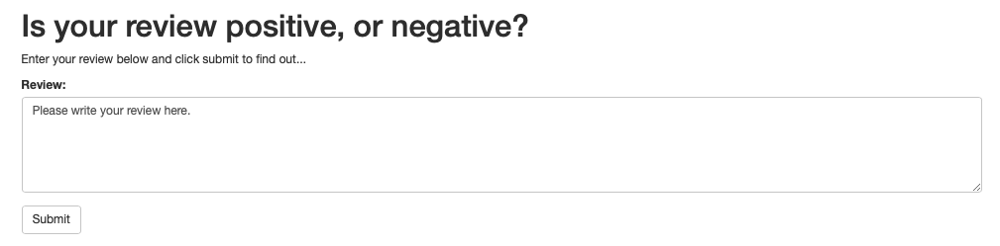
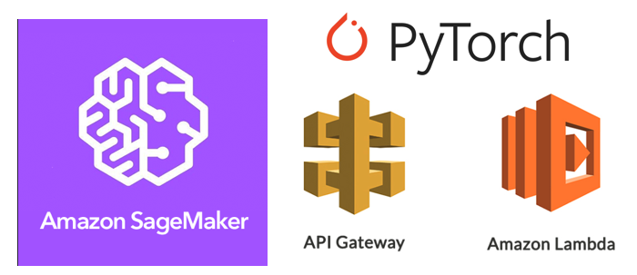

# Create a sentiment analysis web application
## Build and Deploy a model using SageMaker

The `SageMaker Project.ipynb` notebook and Python files provided here, once completed, result in a simple web app which interacts with a deployed recurrent neural network performing sentiment analysis on movie reviews. 

## Architecture
The structure for our web app will look like the diagram below:


### Web App
The user is prompted to enter a review or any piece of text for that matter.


1. To begin with, a user will type out a review and enter it into our web app.
2. Then, our web app will send that review to an endpoint that we created using API Gateway. This endpoint will be constructed so that anyone (including our web app) can use it.
3. API Gateway will forward the data on to the Lambda function
4. Once the Lambda function receives the user's review, it will process that review by tokenizing it and then creating a bag of words encoding of the result. After that, it will send the processed review off to our deployed model.
5. Once the deployed model performs inference on the processed review, the resulting sentiment will be returned back to the Lambda function.
6. Our Lambda function will then return the sentiment result back to our web app using the endpoint that was constructed using API Gateway.

### Output

#### positive review


#### negative review


## Technologies


## Structure
```
|-
  |- SageMaker Project.ipynb - detailed instructions for recreating this project.
  |- train - contains files for launching the training job.
  |- serve - contains predict.py which makes use of the trained model to send realtime predictions.
  |- website - contains the index.html pointing to the API gateway endpoint URL.
```


## Setup Instructions

The `SageMaker Project.ipynb` notebook is intended to be executed using Amazon's SageMaker platform. The following is a brief set of instructions on setting up a managed notebook instance using SageMaker, from which the notebook can be completed and run.

### Log in to the AWS console and create a notebook instance

Log in to the AWS console and go to the SageMaker dashboard. Click on 'Create notebook instance'. The notebook name can be anything and using ml.t2.medium is a good idea as it is covered under the free tier. For the role, creating a new role works fine. Using the default options is also okay. Important to note that you need the notebook instance to have access to S3 resources, which it does by default. In particular, any S3 bucket or object with sagemaker in the name is available to the notebook.

### Use git to clone the repository into the notebook instance

Once the instance has been started and is accessible, click on 'open' to get the Jupyter notebook main page. We will begin by cloning this github repository into the notebook instance. 

Click on the 'new' dropdown menu and select 'terminal'. By default, the working directory of the terminal instance is the home directory, however, the Jupyter notebook hub's root directory is under 'SageMaker'. Enter the appropriate directory and clone the repository as follows.

```bash
cd SageMaker
git clone https://github.com/shravan-kuchkula/sentiment-analysis-web-application.git
exit
```

After you have finished, close the terminal window.

### Open and run the notebook

Now that the repository has been cloned into the notebook instance you can start running the project instructions given inside `SageMaker Project.ipynb`.

> NOTE: The data and cache directories will be created if you follow along the notebook.
